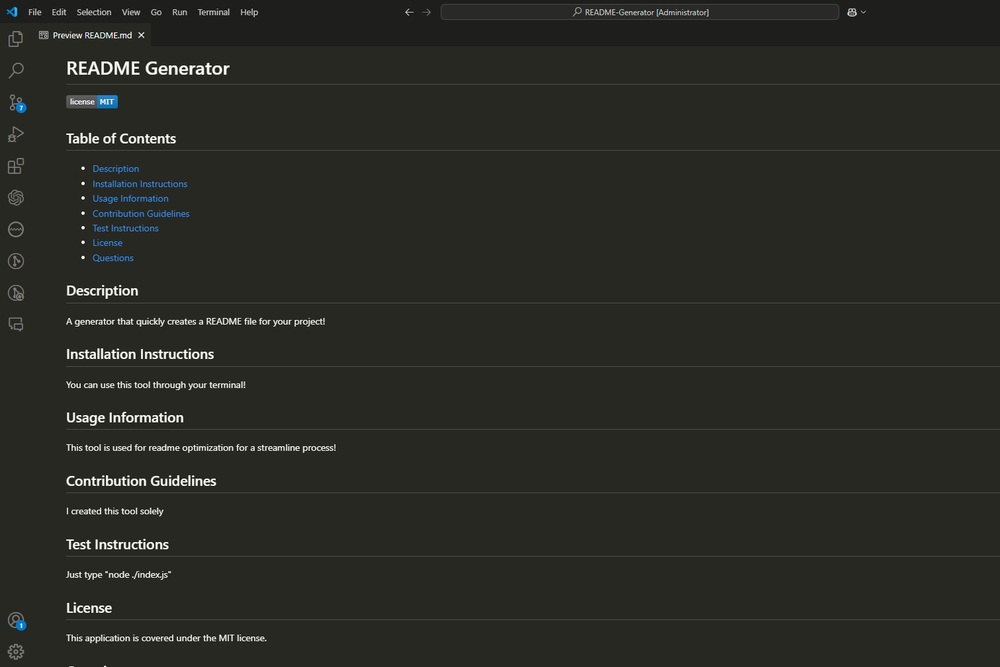

# README Generator

[Test Video](https://youtu.be/zPaGB5U5JfI)

## Table of Contents
- [README Generator](#readme-generator)
  - [Table of Contents](#table-of-contents)
  - [Description](#description)
  - [Installation Instructions](#installation-instructions)
  - [Usage Information](#usage-information)
  - [Contribution Guidelines](#contribution-guidelines)
  - [Test Instructions](#test-instructions)
  - [License](#license)
  - [Questions](#questions)

## Description
A generator that quickly creates a README file for your project!

## Installation Instructions
You can use this tool through your terminal!

## Usage Information
This tool is used for readme optimization for a streamline process!

## Contribution Guidelines
I created this tool solely

## Test Instructions
Just type "node ./index.js"

## License
This application is covered under the MIT license.

## Questions
If you have any questions, you can reach out to me through:
- GitHub: [tatesutter](https://github.com/tatesutter)
- Email: [tatesutter04@gmail.com](mailto:tatesutter04@gmail.com)
